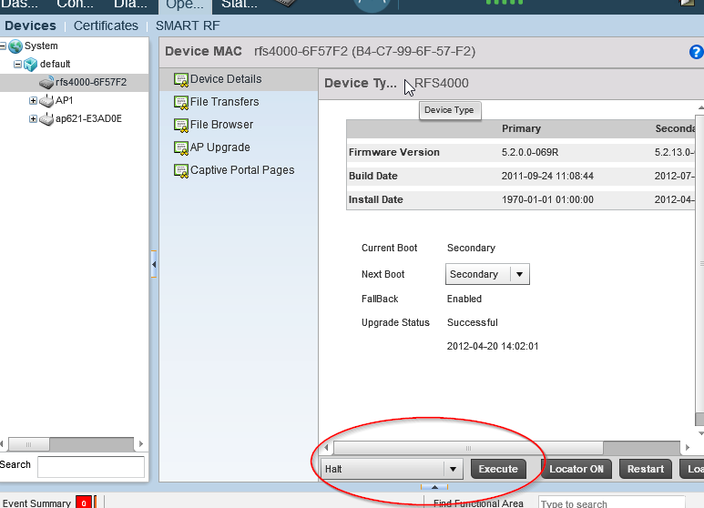

RFS 4000

i stumbled upon this rfs4000 controller with software wing 5.2   

*the history of the ownership-changings over the years show that this device is somehow strange*

one problem i had was to shutdown the device correct.   
i found the shutdown button in the Wing under Operations, at the device's details at the bottom of the pwge.  
There you can select a halt optinon near the execute button (amongst others).

[RFS-4000](https://bobobo-git.github.io/RFS-4000/) <a style="float:right;" href="https://github.com/bobobo-git/RFS-4000/">.</a>
